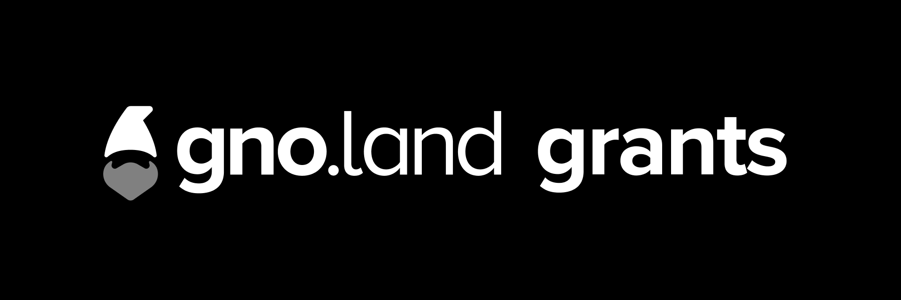

# Gno.land Grants Program

The gno.land grants program provides financial support to developers interested in new blockchain technology, and/or are already actively contributing to gno.land. 

You may be a good fit if at least one of these applies:
* You're passionate about open-source development
* You’ve contributed to gno.land (a plus for your application)
* You’re a Go developer
* You’re a blockchain software developer
* You’re a researcher specializing in a relevant field

#### **Ways to Receive Funding**

1. You have a specific project idea that aligns with our areas of focus.
2. You're interested in blockchain technology and want the chance to explore it further.

While gno.land’s engineering teams are primarily focused on mainnet development, proposals that contribute to this goal or advance the builder’s toolkit with reusable applications, libraries, or substantial contributions will receive priority. However, future funding won’t be limited to grants alone; community-driven funding mechanisms are also part of gno.land’s broader commitment to the ecosystem. When proposing a project, think about its potential to evolve, expand, and be repurposed.

## **Applying for a Project-Based Grant**

We’re looking for formal, detailed project proposals including milestones, deliverables, timelines, and publicly tracked progress. Your application should also include a draft project specification that outlines its impact on the gno.land developer community. While the project doesn’t need to be fully scoped, the proposal should be specific enough for the review committee to assess its contribution.

### **Example Projects**
**Applications (Gno dApps)**

We're looking to support smart contracts written in Gno that can either serve as libraries or gain widespread adoption. Games, social communication tools, or coordination apps are all welcome. These apps should integrate smoothly with the existing gno.land infrastructure, promote user interaction, and encourage the adoption of gno.land services. Examples include:
* Proof-of-person applications
* Building, testing, and launching a suite of gno.land apps that target diverse use cases and industries
* Developing advanced project management software tailored to gno.land developers
* Creating comprehensive documentation, guides, and API references to enhance user understanding
* Implementing an event system for Gno contracts, enabling real-time contract monitoring and auditing

**GnoVM**
* Bug fixes for GnoVM
* Specifications for persistent state garbage collection, both in-realm and across realms
* Specifications for bonded garbage collection, with an incremental and deterministic system
* Gno code fuzzing tools for comparing behavior against the Go compiler
* Improvements to the Gno language to enhance garbage collection, reference counting, merkle hash computation, and smart contract safety
* Interoperability and Integration
* Cross-chain compatibility to allow gno.land to connect with other blockchain networks
* Integrated development environment (IDE) for gno.land developers
* Frameworks to build dApps using Gno contracts as the backend
* Adding Gno support to existing tools (editors, scripts, CI/CD, etc.)

**Infrastructure, Developer Experience, and Quality**

* GitHub and AWS integration, improving deployment, CI/CD pipelines, and monitoring
* Helm charts for Gno cluster deployment
* Improving the testing pipeline and CI/CD
* Enhancing the local development experience for validators and developers

**How to Apply**
* Fork this repository.
* Create a new `.md` file in the [`projects`](./projects) folder named after your project.
* If your proposal contains images, create a folder named after your project to contain the `.md` file and the images.
* Use the [template file](projects/TEMPLATE.md) to outline your proposal.
* Submit a Pull Request (PR).
* Email us the details at [grants@tendermint.com](mailto:grants@tendermint.com).

Our team will review your application, and if it's supported by the engineering team, you’ll be invited to present it for feedback.

## **Don’t Have a Detailed Proposal?**

If you don’t have a project fully scoped out but are eager to contribute, we offer short-term grants to explore how you can help. Depending on the value of your contributions and future proposals, this could lead to renewed funding.
* Fill out our [Google form](https://docs.google.com/forms/d/1CUigL0G4EdqYRO7xFH7wUprNAN51-oVQOTelwfyfmSQ/edit) to introduce yourself.

We’ll review your submission, and if it’s a good fit, we’ll schedule a brief call to discuss your ideas, goals, and next steps. If you're ready to begin or have questions, reach out to us at grants@tendermint.com.
